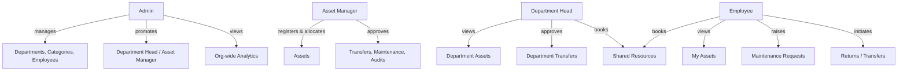
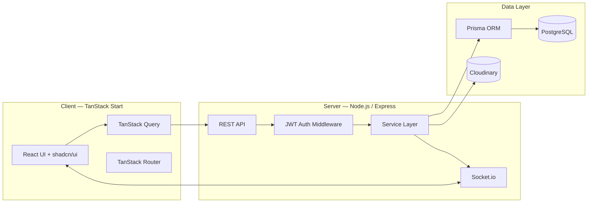
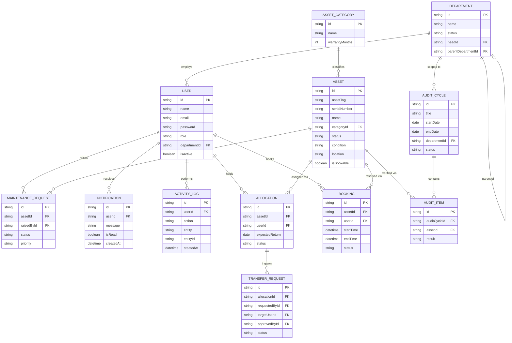
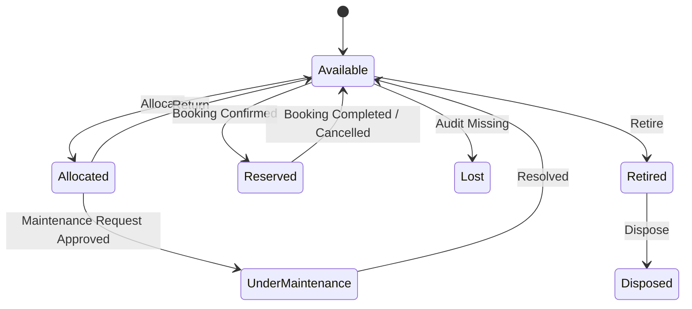
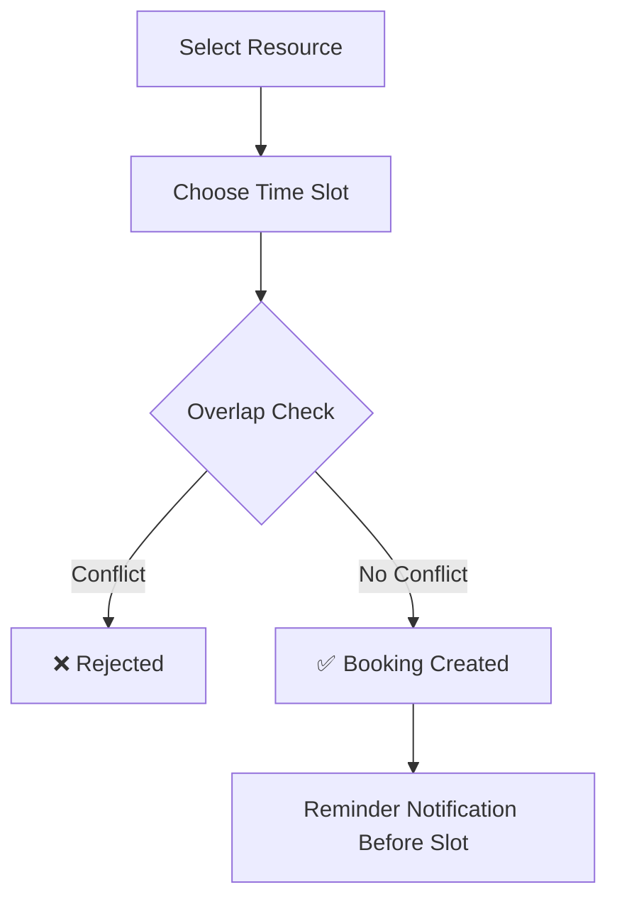
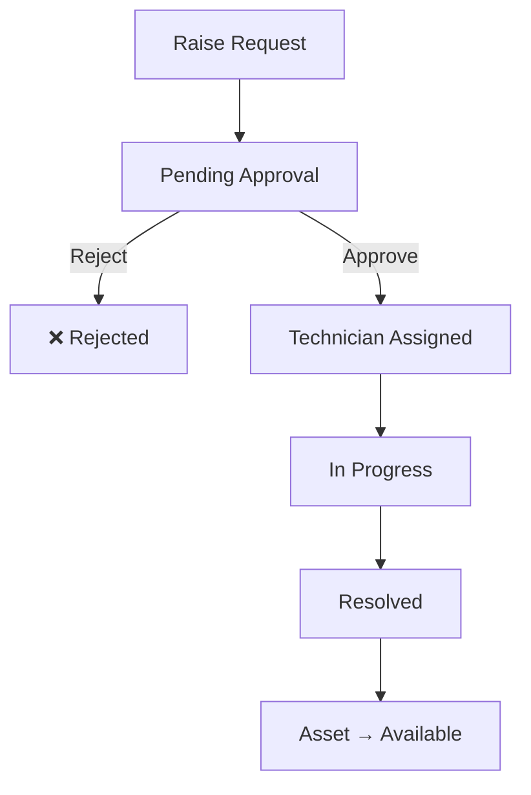

<div align="center">

# 🏢 AssetFlow

### Enterprise Asset & Resource Management System

*A modern ERP platform that replaces spreadsheets and paper logs with structured asset lifecycles, conflict-free resource booking, and real-time operational visibility.*


[](#)
[](#)
[](#)
[](#)
[](#)
[](#)

[Live Demo](#) · [Screenshots](#-screenshots) · [Getting Started](#-getting-started) · [Report Bug](#)

</div>

---

## 📖 Table of Contents

- [Overview](#-overview)
- [Problem Statement](#-problem-statement)
- [Screenshots](#-screenshots)
- [Features](#-features)
- [User Roles](#-user-roles)
- [Tech Stack](#-tech-stack)
- [System Architecture](#-system-architecture)
- [Database Schema (ERD)](#-database-schema-erd)
- [Core Workflows](#-core-workflows)
- [Project Structure](#-project-structure)
- [Getting Started](#-getting-started)
- [Environment Variables](#-environment-variables)
- [Dashboard KPIs](#-dashboard-kpis)
- [Future Enhancements](#-future-enhancements)
- [Team](#-team)
- [License](#-license)

---

## 🎯 Overview

**AssetFlow** is a centralized Enterprise Resource Planning (ERP) module built for organizations that manage physical assets and shared resources — equipment, furniture, vehicles, meeting rooms, and more. Instead of tracking who holds what asset through scattered spreadsheets, AssetFlow gives every role — from Admins to Employees — a single source of truth with structured lifecycles, real-time conflict prevention, and full auditability.

Built for the **Odoo Hackathon**, AssetFlow focuses on doing ERP fundamentals *right*: clean architecture, secure role-based workflows, and a UI that doesn't look like a hackathon project.

> AssetFlow deliberately stays out of purchasing, invoicing, and accounting — it's built to do asset lifecycle and resource operations exceptionally well, not to be a full accounting suite.

---

## ❓ Problem Statement

Organizations relying on manual tracking face recurring pain points:

| Problem | AssetFlow's Answer |
|---|---|
| No visibility into who holds what asset | Centralized allocation tracking with full history |
| Double-booked meeting rooms / equipment | Automatic time-slot overlap detection |
| Repairs happening without approval | Structured maintenance approval workflow |
| Assets "disappearing" over time | Scheduled audit cycles with discrepancy reports |
| Missed returns and deadlines | Automated overdue detection + notifications |
| Self-assigned admin access | Role promotion locked to a single controlled screen |

---

## 🖼 Screenshots

<!-- Drop your real screenshots into a /docs/screenshots folder and update these paths -->

<!-- Update the <b> labels below to match what each screenshot actually shows -->
<table>
  <tr>
    <td align="center"><b>Dashboard</b><br/></td>
    <td align="center"><b>Asset Directory</b><br/></td>
  </tr>
  <tr>
    <td align="center"><b>Resource Booking</b><br/></td>
    <td align="center"><b>Maintenance Board</b><br/></td>
  </tr>
  <tr>
    <td align="center"><b>Audits</b><br/></td>
    <td align="center"><b>Reports & Analytics</b><br/></td>
  </tr>
</table>

---

## ✨ Features

<table>
<tr>
<td width="50%" valign="top">

### 🔐 Authentication & Authorization
- Secure Login & Signup
- JWT-based authentication
- Forgot password flow
- Role-Based Access Control (RBAC)
- Session validation

### 👥 Organization Setup
- Department management (with hierarchy)
- Asset category management
- Employee directory
- Admin-controlled role promotion

### 📦 Asset Management
- Register new assets with auto-generated tags
- Search & filter (tag, serial, QR, category, status)
- Full lifecycle tracking
- Per-asset allocation & maintenance history

### 🔄 Allocation & Transfers
- Allocate assets to employees/departments
- Double-allocation prevention
- Transfer request workflow
- Return flow with condition check-in
- Overdue return tracking

</td>
<td width="50%" valign="top">

### 📅 Resource Booking
- Calendar-based booking view
- Real-time slot overlap detection
- Booking status lifecycle
- Cancel & reschedule support

### 🛠 Maintenance Management
- Raise requests with priority & photos
- Approval workflow before repair starts
- Technician assignment
- Auto asset-status updates

### ✅ Asset Audits
- Scheduled audit cycles
- Multi-auditor assignment
- Verified / Missing / Damaged tagging
- Auto-generated discrepancy reports

### 📊 Dashboard & Reports
- Real-time KPI dashboard
- Utilization & maintenance trend charts
- Department-wise allocation summary
- Booking heatmaps + exportable reports

### 🔔 Notifications & Logs
- Real-time alerts
- Overdue & reminder notifications
- Full activity audit trail

</td>
</tr>
</table>

---

## 👤 User Roles



| Role | Key Responsibilities |
|---|---|
| **Admin** | Departments, categories, employee directory, role assignment, org-wide analytics, audit cycle setup |
| **Asset Manager** | Registers & allocates assets, approves transfers/maintenance/returns |
| **Department Head** | Views & manages department assets, approves department-level transfers, books resources |
| **Employee** | Views assigned assets, books resources, raises maintenance requests, initiates returns/transfers |

> 🔒 **Security note:** Roles are never self-assigned. Signup only ever creates an Employee account — Admins promote users to Department Head / Asset Manager from a single, confirmation-gated screen.

---

## 🛠 Tech Stack

<table>
<tr>
<td valign="top" width="33%">

**Frontend**
- TanStack Start (React)
- TanStack Router
- TypeScript
- Tailwind CSS
- shadcn/ui
- TanStack Query
- React Hook Form
- Recharts
- FullCalendar

</td>
<td valign="top" width="33%">

**Backend**
- Node.js
- Express.js
- Prisma ORM
- Socket.io (real-time notifications)

</td>
<td valign="top" width="33%">

**Data & Infra**
- PostgreSQL
- JWT + bcrypt (auth)
- Cloudinary (file/image storage)

</td>
</tr>
</table>

---

## 🏗 System Architecture



---

## 🗄 Database Schema (ERD)



---

## 🔄 Core Workflows

### Asset Lifecycle



### Resource Booking Flow



### Maintenance Approval Flow



---

## 📂 Project Structure

```text
AssetFlow/
│
├── client/                    # TanStack Start frontend
│   ├── src/
│   │   ├── components/        # Reusable UI components (shadcn/ui based)
│   │   ├── hooks/              # Custom React hooks
│   │   ├── lib/                 # Utilities, API client, helpers
│   │   ├── routes/              # File-based routes (TanStack Router)
│   │   ├── router.tsx
│   │   └── routeTree.gen.ts
│   └── package.json
│
├── server/                    # Node.js / Express backend
│   ├── controllers/            # Request handlers
│   ├── routes/                 # API route definitions
│   ├── middleware/             # Auth, validation, error handling
│   ├── services/               # Business logic layer
│   ├── prisma/                 # Prisma schema & migrations
│   ├── utils/
│   └── package.json
│
└── README.md
```

---

## 🚀 Getting Started

### Prerequisites
- Node.js (v18+)
- PostgreSQL instance (local or hosted)
- npm

### 1. Clone the Repository

```bash
git clone <repository-url>
cd AssetFlow
```

### 2. Install Dependencies

**Frontend**
```bash
cd client
npm install
```

**Backend**
```bash
cd server
npm install
```

### 3. Configure Environment Variables

Create a `.env` file in `server/` (see [Environment Variables](#-environment-variables) below).

### 4. Run Database Migrations

```bash
cd server
npx prisma migrate dev
```

### 5. Start Development Servers

**Backend**
```bash
cd server
npm run dev
```

**Frontend**
```bash
cd client
npm run dev
```

The app will be available at `http://localhost:5173` (frontend) and your configured API port (backend).

---

## 🔑 Environment Variables

Create a `.env` file inside `server/`:

```env
DATABASE_URL=
JWT_SECRET=
JWT_EXPIRES_IN=
CLOUDINARY_CLOUD_NAME=
CLOUDINARY_API_KEY=
CLOUDINARY_API_SECRET=
CLIENT_URL=
PORT=
```

> ⚠️ Never commit `.env` to version control. Ensure it's listed in `.gitignore`.

---

## 📈 Dashboard KPIs

| KPI | Description |
|---|---|
| 📦 Total Assets | All registered assets across the org |
| ✅ Available Assets | Ready-to-allocate assets |
| 🔗 Allocated Assets | Currently held by employees/departments |
| 📅 Active Bookings | Ongoing/upcoming resource bookings |
| 🛠 Maintenance Today | Requests scheduled/active today |
| 🔄 Pending Transfers | Transfer requests awaiting approval |
| ⏰ Upcoming Returns | Returns due soon |
| 🚨 Overdue Returns | Past expected return date |
| 🔍 Audit Progress | Completion status of active audit cycles |

---

## 🎯 Future Enhancements

- [ ] QR code scanning for asset check-in/out
- [ ] Barcode support
- [ ] AI-powered maintenance prediction
- [ ] Native mobile application
- [ ] Push notifications
- [ ] Bulk asset import (CSV/Excel)
- [ ] Advanced analytics & forecasting
- [ ] Multi-organization / multi-tenant support

---

## 👥 Team

| Name | Role | 
|---|---|
| _Your Name_ | Frontend Engineer |
| _Teammate Name_ | Backend Engineer |
| _Teammate Name_ | — |

---

## 📄 License

This project was developed for the **Odoo Hackathon** and is intended for educational and demonstration purposes.

---

<div align="center">

**Built with ❤️ for the Odoo Hackathon**

</div>